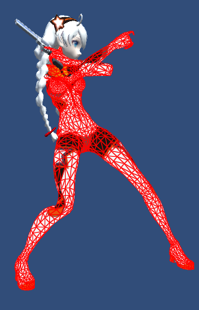
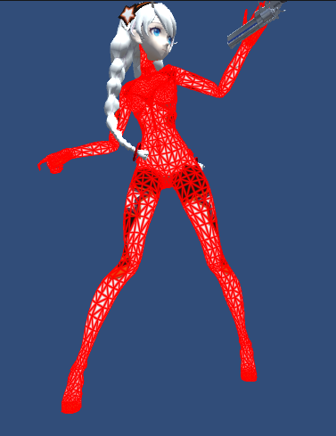
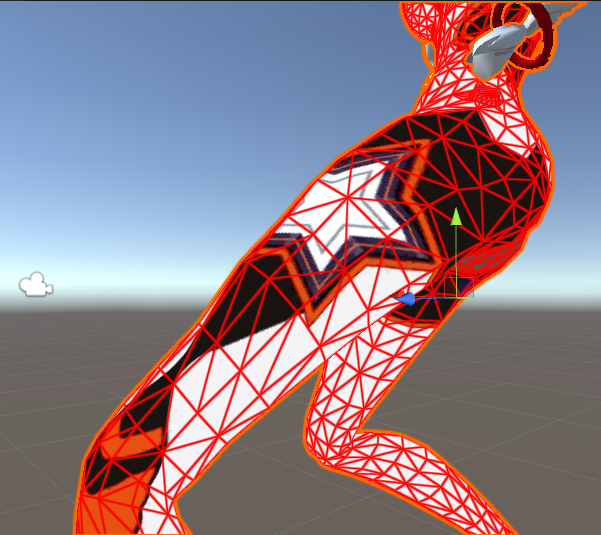
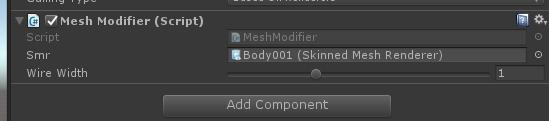

# UnityWireFrame
### 在 Unity 内给 Mesh 画 WireFrame，目前存在的问题是会增大 Mesh 的尺寸，但此实现无需 Geometry Shader

### 预览

### Refererence
http://codeflow.org/entries/2012/aug/02/easy-wireframe-display-with-barycentric-coordinates/
https://stackoverflow.com/questions/7361582/opengl-debugging-single-pass-wireframe-rendering